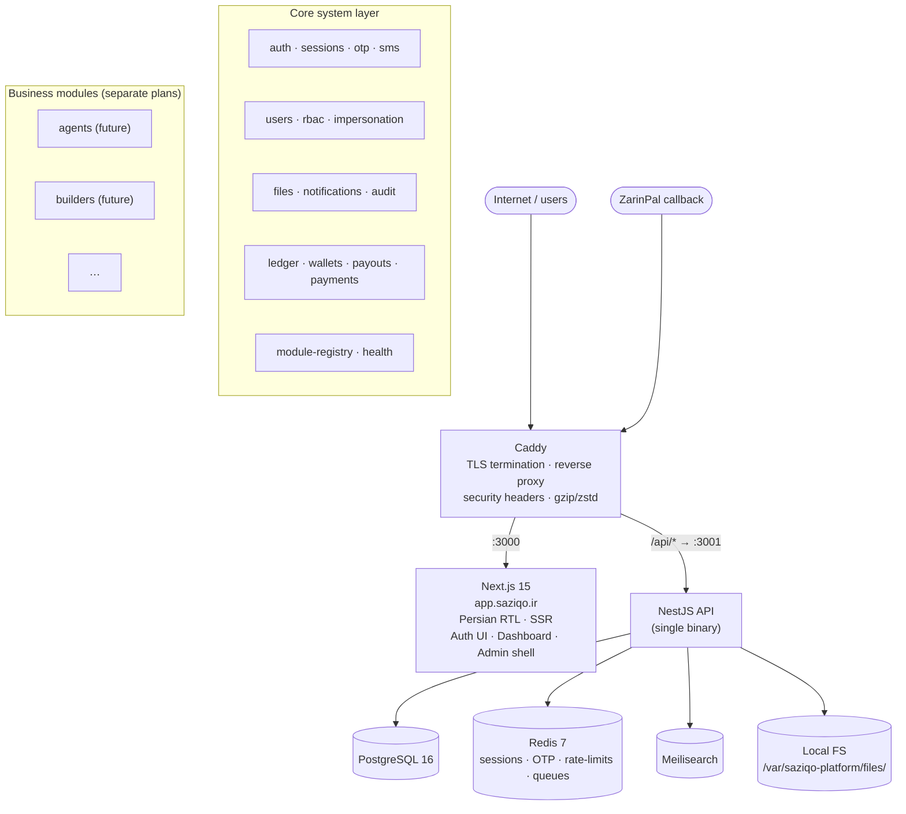
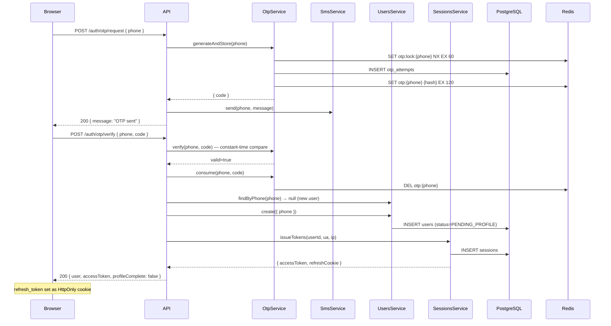
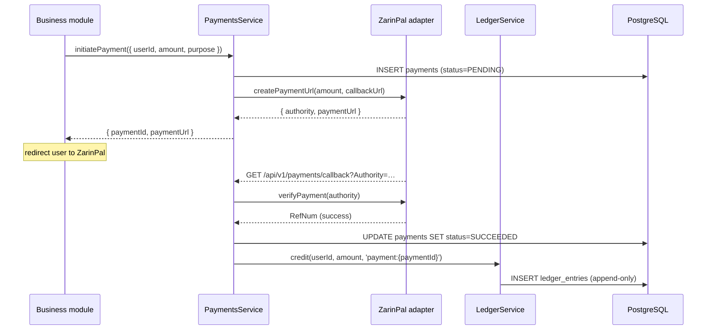

# Architecture — سازیکو Platform

## Overview

سازیکو Platform is a **modular monolith**: one NestJS binary and one Next.js application, deployed on a single Iranian VPS. Modules share one process, one database connection pool, and one Redis instance, but are isolated by strict conventions — table prefixes, lint-enforced import rules, and event-only cross-module communication — rather than by network boundaries.



---

## Tech stack

| Layer            | Technology                                    | Notes                                       |
| ---------------- | --------------------------------------------- | ------------------------------------------- |
| Backend          | NestJS (TypeScript strict, ESM)               | Single deployable binary                    |
| Frontend         | Next.js 15 App Router + Tailwind + shadcn/ui  | Persian RTL throughout                      |
| Database         | PostgreSQL 16 + Prisma ORM                    | Append-only migrations                      |
| Cache / Queue    | Redis 7 + BullMQ                              | Sessions, OTP, rate-limits, background jobs |
| Search           | Meilisearch                                   | Self-hosted, MIT license                    |
| Auth             | Phone + SMS OTP; TOTP for `super_admin`       | No passwords anywhere                       |
| Payments         | ZarinPal (behind `PaymentProvider` interface) | Console adapter in dev/test                 |
| File storage     | Local FS behind `FileStore` interface         | `/var/saziqo-platform/files/`               |
| Package manager  | pnpm 10                                       | Workspace monorepo                          |
| Monorepo tooling | Turborepo (no remote cache)                   |                                             |
| Container        | Docker + Docker Compose                       | Multi-stage builds                          |
| Reverse proxy    | Caddy                                         | Automatic Let's Encrypt TLS                 |

---

## Repository layout

```
saziqo-platform/
├── apps/
│   ├── api/                  — NestJS backend
│   │   ├── src/core/         — System layer (auth, rbac, users, files, …)
│   │   ├── src/modules/      — Business modules (added per separate plans)
│   │   ├── src/common/       — Interceptors, filters, pipes, guards, decorators
│   │   └── prisma/           — Schema + append-only migrations
│   └── web/                  — Next.js 15 frontend
│       ├── src/app/          — Route groups: (public) (auth) (account) (admin)
│       ├── src/components/
│       ├── src/lib/          — API client, auth helpers, i18n, Persian utils
│       └── src/store/        — Zustand auth store
├── packages/
│   ├── config/               — Shared tsconfig, ESLint, Prettier, Jest presets
│   ├── shared-types/         — TypeScript types shared between api and web
│   ├── shared-validators/    — Zod schemas
│   ├── persian-utils/        — Phone normalization, national ID, Jalali, numerals
│   └── ui/                   — Cross-app component primitives
├── infra/
│   ├── caddy/                — Caddyfile
│   ├── docker/               — docker-compose.prod.yml
│   └── scripts/              — provision.sh, deploy.sh, backup.sh, harden.sh, scan-deps.sh
└── docs/                     — This directory
```

---

## Core system layer

`apps/api/src/core/` is the system layer — shared infrastructure every business module depends on. No domain business logic lives here.

| Module            | Responsibility                                                                          |
| ----------------- | --------------------------------------------------------------------------------------- |
| `auth`            | `POST /auth/otp/request` and `/auth/otp/verify`; login branch logic                     |
| `otp`             | Generate 6-digit code, store sha256 hash in Redis + DB, verify (constant-time), consume |
| `sms`             | SMS provider abstraction; Kavenegar adapter in prod, console adapter in dev             |
| `sessions`        | JWT issuance, refresh-token rotation, replay detection, revocation                      |
| `users`           | User CRUD, profile gate, self-read and admin-read endpoints                             |
| `rbac`            | Roles, permissions, `@RequirePermission` decorator, `RbacGuard`                         |
| `audit`           | Append-only audit log; `AuditInterceptor` wraps every privileged action                 |
| `files`           | `FileStore` interface; `LocalFileStore` implementation; upload/download endpoints       |
| `notifications`   | In-app + SMS dispatch; template registry; modules register their own types              |
| `ledger`          | Append-only `ledger_entries`; credit/debit/balance/transfer atomicity                   |
| `wallets`         | Per-user balance abstraction over `LedgerService`                                       |
| `payouts`         | Payout queue table; manual approval workflow; admin action endpoints                    |
| `payments`        | `PaymentProvider` interface; ZarinPal adapter; callback verify + ledger credit          |
| `impersonation`   | Admin impersonation start/stop; short-lived access token with `imp` JWT claim           |
| `module-registry` | `PlatformModule` contract, in-memory registry, boot-time loader                         |
| `health`          | `GET /api/v1/health` — PostgreSQL + Redis liveness checks, returns 503 on failure       |
| `redis`           | ioredis client wrapper (`RedisService`)                                                 |
| `prisma`          | `PrismaService` with `onModuleInit` connect                                             |

---

## HTTP request pipeline

Every request passes through this chain before reaching a controller. The order is significant.

```mermaid
flowchart LR
    In([HTTP]) --> RL["RateLimitGuard\nRedis sliding window\nper-user + per-IP"]
    RL --> AI["AuditInterceptor\n(outermost)"]
    AI --> II["IdempotencyInterceptor\nRedis 24h dedup"]
    II --> RI["ResponseInterceptor\nwraps result in { data, meta? }"]
    RI --> AG["JwtAuthGuard\nverify Bearer JWT"]
    AG --> RG["RbacGuard\n@RequirePermission check"]
    RG --> ZP["ZodBodyPipe\nreject unknown props"]
    ZP --> H["Controller handler"]
    H -.->|throws| EF["AllExceptionsFilter\nnormalize error shape"]
```



Interceptors apply **outermost-first** on ingress; the response path reverses. Concretely:

1. `ResponseInterceptor` wraps the raw handler return value into `{ data, meta? }`.
2. `IdempotencyInterceptor` caches the wrapped envelope keyed on `Idempotency-Key`; cache hits skip the handler entirely but still return the full wrapped response.
3. `AuditInterceptor` writes the audit row after the wrapped, idempotency-resolved value is known — cache hits are still audited as attempts.

Provider declaration order in `apps/api/src/app.module.ts` determines the interceptor stack.

---

## Data flow examples

### New user signs up



### Business module calls core payment + ledger

A module never touches `ledger_entries` directly — it calls `PaymentsService`, which calls `LedgerService` after gateway confirmation.



---

## Modular monolith rationale

**Why not microservices?**

The platform runs on a single Iranian VPS (4 vCPU / 4 GB RAM). Cross-service network latency on this hardware class would dominate database query time. Operational complexity — service meshes, distributed tracing, independent CI pipelines — is disproportionate for an early-stage product. Database transactions spanning two bounded contexts are trivial in a monolith and require distributed sagas across services.

**Why modular?**

Table prefixes (`agents_*`, `builders_*`) and lint-enforced import rules keep module code from becoming tangled as the team grows. The `PlatformModule` contract is the natural extraction unit if a specific domain later hits scale: routes, permissions, migrations, and lifecycle hooks are all declared in one place and can move together.

---

## API conventions summary

| Convention    | Rule                                                                                          |
| ------------- | --------------------------------------------------------------------------------------------- |
| Base path     | `/api/v1/{module}/{resource}`                                                                 |
| Success shape | `{ data, meta? }`                                                                             |
| Error shape   | `{ error: { code, message, details? } }`                                                      |
| Validation    | Zod schemas via `nestjs-zod`; unknown properties rejected at boundary                         |
| Auth          | JWT `Authorization: Bearer` header; refresh token in `HttpOnly Secure SameSite=Strict` cookie |
| Pagination    | Cursor-based `?cursor=…&limit=…`                                                              |
| Idempotency   | All write endpoints accept `Idempotency-Key` header (Redis 24h dedup)                         |
| Rate limiting | Per-user + per-IP, Redis-backed; remaining quota in response headers                          |
| Dates         | UTC ISO 8601 in API; Jalali calendar only in frontend UI                                      |
| Currency      | Integer toman (BIGINT) — no decimals                                                          |
| Phone         | E.164 `+989XXXXXXXXX` in DB and API                                                           |
| National ID   | 10-digit string validated by Iranian checksum algorithm                                       |

Full reference: `docs/api-conventions.md` (Phase 24C).
