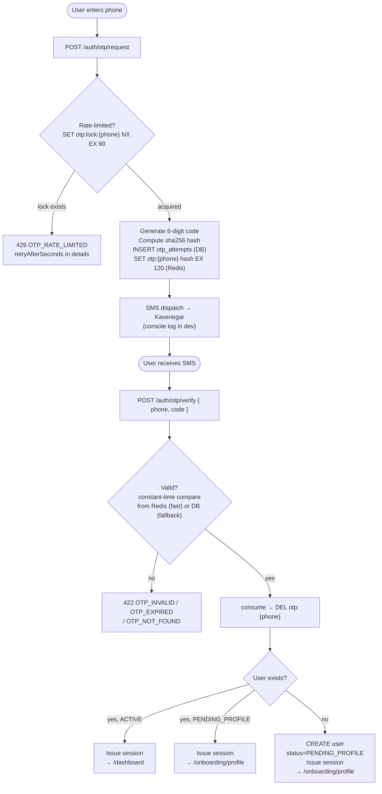
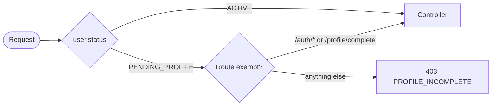
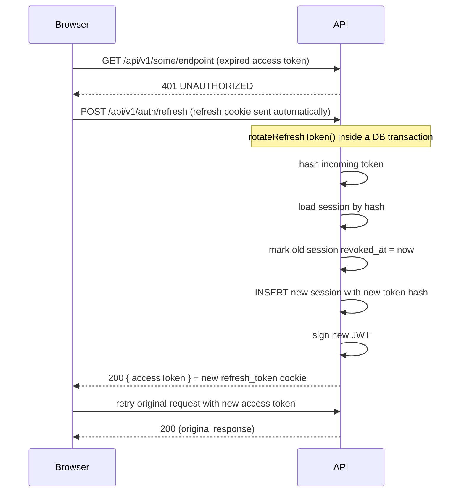
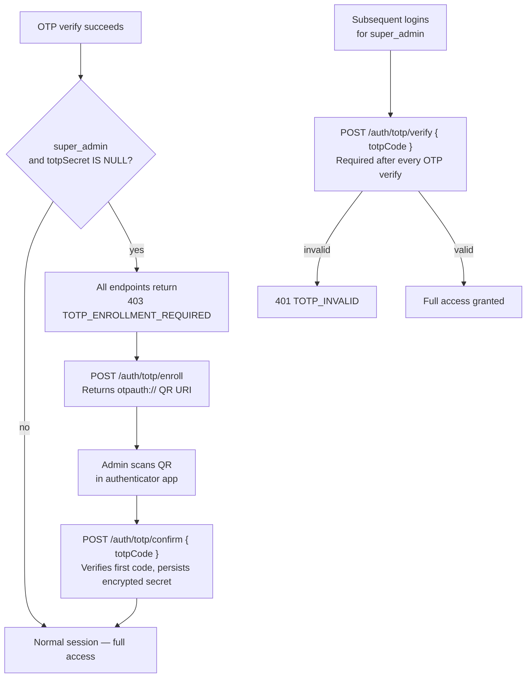

# Auth Flow — سازیکو Platform

Authentication is **phone number + SMS OTP only**. No passwords exist anywhere in the system. The `super_admin` role requires TOTP in addition to OTP.

---

## OTP request and verify



### Rate limits and OTP security

| Property           | Value                                                  | Mechanism                                                 |
| ------------------ | ------------------------------------------------------ | --------------------------------------------------------- |
| Request cooldown   | 60 s between requests per phone                        | `SET otp:lock:{phone} 1 NX EX 60` — atomic, prevents race |
| OTP TTL            | 120 s                                                  | Redis `SET otp:{phone} {hash} EX 120`                     |
| Max daily attempts | 5 per phone per 24 h                                   | `otp_attempts.attempts` column in PostgreSQL              |
| Code storage       | sha256(code + phone + salt) — raw code never persisted | Redis value; `otp_attempts.code_hash` in DB               |
| Verification       | Constant-time HMAC comparison                          | `crypto.timingSafeEqual` — no timing oracle               |
| Consumption        | Redis key deleted immediately on first valid verify    | Single-use                                                |

Source: `apps/api/src/core/otp/otp.service.ts`

### Test-mode OTP backdoor

When `NODE_ENV=test`, the OTP service also stores the plain code at `otp:test:{phone}` (TTL 120 s). The endpoint `GET /api/v1/_test/last-otp/:phone` reads this key, enabling Playwright E2E tests to complete the auth flow without real SMS. The endpoint throws 404 in any other environment. Source: `apps/api/src/core/_test/test.controller.ts`.

---

## Phone number normalization

All phones are normalized to E.164 (`+989XXXXXXXXX`) before storage, Redis key generation, or any comparison. Source: `packages/persian-utils/src/phone.ts`.

| Input           | Normalized       |
| --------------- | ---------------- |
| `09121234567`   | `+989121234567`  |
| `9121234567`    | `+989121234567`  |
| `+989121234567` | `+989121234567`  |
| anything else   | validation error |

The frontend validates Iranian format (`09XXXXXXXXX`) before submitting, and always sends normalized E.164 in request bodies.

---

## Profile completion gate

New users are created with `status = PENDING_PROFILE`. A guard blocks access to all API endpoints except `/auth/*` and `/users/profile/complete` until profile data is submitted.



Required fields for the `PENDING_PROFILE → ACTIVE` transition:

| Field        | Validation                                                     |
| ------------ | -------------------------------------------------------------- |
| `firstName`  | Persian Unicode characters only                                |
| `lastName`   | Persian Unicode characters only                                |
| `nationalId` | 10-digit string, passes Iranian national ID checksum algorithm |
| `email`      | RFC 5322 format                                                |

On successful submit, `users.status` is set to `ACTIVE` in a single database transaction and the response includes a freshly-issued access token reflecting the new status.

---

## Session lifecycle

### Token pair

| Token         | Type                               | TTL                                            | Storage                                             | Transport                                                                           |
| ------------- | ---------------------------------- | ---------------------------------------------- | --------------------------------------------------- | ----------------------------------------------------------------------------------- |
| Access token  | JWT (HS256)                        | 15 minutes (configurable via `JWT_EXPIRES_IN`) | Stateless — not stored server-side                  | `Authorization: Bearer …` header                                                    |
| Refresh token | Opaque 64 random bytes (base64url) | 30 days                                        | sha256 hash stored in `sessions.refresh_token_hash` | `refresh_token` HttpOnly Secure SameSite=Strict cookie, path `/api/v1/auth/refresh` |

The cookie path restricts the browser to sending the refresh cookie only to the rotation endpoint, not to every API call.

### Refresh token rotation



Every refresh call is a **single atomic DB transaction** covering: find session → revoke old → insert new. The four outcomes:

| Incoming token state             | Response                                                      |
| -------------------------------- | ------------------------------------------------------------- |
| Not found in DB                  | 401 `SESSION_INVALID`                                         |
| Found, `revoked_at` set (replay) | 401 `SESSION_REPLAY` + **all sessions for this user revoked** |
| Found, past `expires_at`         | 401 `SESSION_EXPIRED` + session revoked                       |
| Found, valid                     | 200 new token pair + old session revoked                      |

The replay case (presenting a previously-revoked refresh token) triggers a full account session wipe as defense in depth — an attacker who obtained an old token cannot probe the system.

Source: `apps/api/src/core/sessions/sessions.service.ts`

### Session revocation

Sessions can be revoked by:

- **The user** — from their active sessions page: `DELETE /auth/sessions/:sessionId`
- **An admin** — from the user detail page in the admin shell (same endpoint with admin-level permission)
- **The platform automatically** — on refresh-token replay detection (all user sessions revoked)

Revoked sessions remain in the `sessions` table with `revoked_at` set. The table is append-only from an audit perspective.

---

## Impersonation tokens (S3)

Admin impersonation (`POST /admin/impersonation/start`) issues a short-lived access token with an `imp` JWT claim binding it to an `impersonation_sessions` row:

```json
{
  "sub": "456",       // target user ID (who is being impersonated)
  "imp": "789",       // impersonation_sessions.id
  "actor": "123",     // admin's user ID
  "iat": …,
  "exp": …            // 15-minute expiry (JWT_EXPIRES_IN, same as normal)
}
```

**No refresh token is issued for impersonation.** The admin's original refresh cookie is left untouched. Impersonation is short-lived by design.

`JwtAuthGuard` validates the `imp` claim against the `impersonation_sessions` table on every request. Calling `POST /admin/impersonation/stop` sets `ended_at` on that row; all subsequent requests with the impersonation access token return 401, and the frontend bootstraps from the admin's preserved refresh cookie to restore the admin's own session.

Impersonation start requires:

- The `admin:impersonate:user` permission
- The `X-Admin-Confirm: true` header (S6 safeguard)
- A `reason` field (minimum 10 characters) in the request body, recorded in the `impersonation_sessions` table and the audit log

Source: `apps/api/src/core/impersonation/`

---

## Super-admin TOTP

Users with the `super_admin` role must enroll in TOTP (RFC 6238, 30-second window) before full access is granted.



TOTP secrets are stored encrypted at rest using `OTP_SALT` as the encryption key. A 30-second TOTP code window is validated; a ±1 step tolerance is allowed for clock skew.

---

## JWT claims structure

Access token payload (abbreviated):

```json
{
  "sub": "123", // user ID (bigint serialized as string)
  "roles": ["admin"], // role names from the DB at issuance time
  "profileComplete": true, // whether status === ACTIVE
  "iat": 1700000000,
  "exp": 1700000900
}
```

The `roles` claim is a snapshot at issuance time. Changing a user's roles does not invalidate existing access tokens; it takes effect at the next refresh rotation. Access tokens are short-lived (15 min) to bound the window of stale role data.

---

## Security properties

| Property                      | Mechanism                                                                                 |
| ----------------------------- | ----------------------------------------------------------------------------------------- |
| No password storage           | No password column exists in the schema                                                   |
| OTP confidentiality           | sha256 hash with phone + salt; raw code lives only in SMS and process memory              |
| Timing-safe verification      | `crypto.timingSafeEqual` — no timing oracle                                               |
| Refresh token theft detection | Replay detection → revoke all sessions for the user                                       |
| Session binding               | `user_agent` and `ip_address` stored for audit visibility (not used for access decisions) |
| HTTPS enforced                | Caddy terminates TLS; `Strict-Transport-Security` header with preload directive           |
| Cookie security               | HttpOnly, Secure, SameSite=Strict, scoped to `/api/v1/auth/refresh`                       |
| Impersonation audit           | Every start/stop recorded in `audit_log` and `impersonation_sessions`                     |
