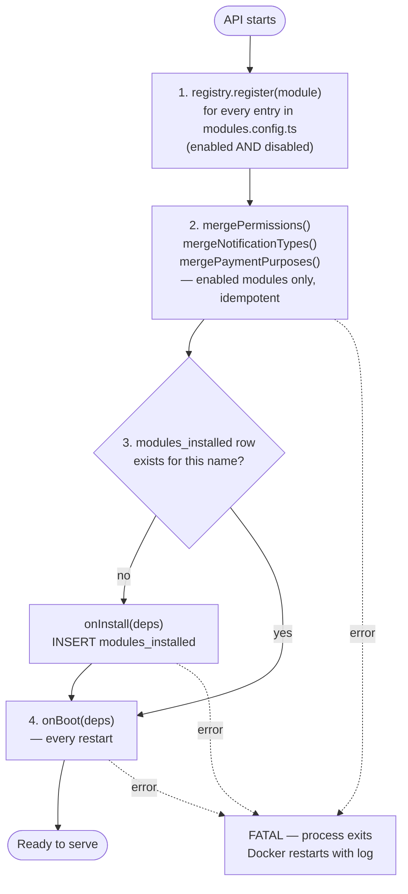

# Module Contract — سازیکو Platform

Every business module (agents, builders, templates, tools, …) must implement the `PlatformModule` interface. This document explains the contract, how to build a new module from the reference skeleton, and the isolation rules that keep the monolith maintainable.

---

## PlatformModule interface

Source: `apps/api/src/core/module-registry/types.ts`

```typescript
export interface PlatformModule {
  // Identity
  readonly name: string; // e.g. 'agents' — becomes DB table prefix
  readonly persianName: string; // e.g. 'ایجنت‌ها' — displayed in admin shell
  readonly version: string; // semver — bump on breaking schema change
  readonly enabled: boolean; // false = ships dark (no routes, no hooks)

  // Required
  registerNestModule(): Type<unknown>; // returns the @Module() class
  registerPermissions(): readonly PermissionDefinition[]; // RBAC permission definitions
  registerAuditActions(): Readonly<Record<string, string>>; // audit event code catalog

  // Optional — omit when the module does not need the capability
  registerNotificationTypes?(): readonly NotificationTypeDefinition[];
  registerAdminPages?(): readonly AdminPageDefinition[];
  registerPaymentPurposes?(): readonly string[];

  // Lifecycle hooks
  onInstall?(deps: ModuleDeps): Promise<void>; // runs exactly once on first boot
  onBoot?(deps: ModuleDeps): Promise<void>; // runs on every startup
  onShutdown?(deps: ModuleDeps): Promise<void>; // reserved, not yet called
}
```

### ModuleDeps

`ModuleDeps` is passed to every lifecycle hook. It injects the full core service layer.

```typescript
export interface ModuleDeps {
  readonly prisma: PrismaService;
  readonly redis: RedisService;
  readonly fileStore: FileStore;
  readonly ledger: LedgerService;
  readonly payments: PaymentsService;
  readonly notifications: NotificationsService;
  readonly audit: AuditService;
  readonly config: ConfigService;
  readonly logger: Logger;
}
```

For service calls inside controller handlers (not lifecycle hooks), inject core services directly through the NestJS constructor — do not pass `ModuleDeps` around at runtime.

---

## Boot sequence

`ModuleLoaderService.onApplicationBootstrap()` runs after every provider is constructed, before NestJS accepts traffic. Source: `apps/api/src/core/module-registry/module-loader.service.ts`.



Boot failures are fatal: any hook error causes the process to exit immediately. This prevents a partially-loaded system from silently serving traffic.

The `modules_installed` row is the only source of truth for "was `onInstall` already run." Never delete these rows manually and never reuse a module name after decommissioning.

---

## Writing a new module

### Step 1 — Copy the reference skeleton

```bash
cp -r apps/api/src/modules/_example apps/api/src/modules/{name}
```

Then perform a case-sensitive find-replace throughout the new directory:

- `_example` → `{name}` (e.g. `agents`)
- `Example` / `example` → `{CapName}` / `{name}` as appropriate

The `_example` module exercises every contract method and is the canonical reference. Do not remove it from the repository.

### Step 2 — Define the PlatformModule instance

`apps/api/src/modules/{name}/index.ts` holds the singleton that the registry ingests:

```typescript
import type { PlatformModule } from '../../core/module-registry/types';
import { {CapName}NestModule } from './{name}.module';

const enabled =
  process.env.ENABLE_{NAME}_MODULE !== undefined
    ? process.env.ENABLE_{NAME}_MODULE === 'true'
    : process.env.NODE_ENV !== 'production'; // dev-on, prod-off by default

const {name}Module: PlatformModule = {
  name: '{name}',
  persianName: '{نام فارسی}',
  version: '0.1.0',
  enabled,

  registerNestModule: () => {CapName}NestModule,

  registerPermissions() {
    return [
      {
        code: '{name}:read:listing',
        description: 'List {name} items',
        persianDescription: '…',
        defaultRoles: ['user'],
      },
    ];
  },

  registerAuditActions() {
    return { '{NAME}_ITEM_CREATED': '{NAME}_ITEM_CREATED' };
  },
};

export default {name}Module;
```

### Step 3 — Create the NestJS @Module class

`apps/api/src/modules/{name}/{name}.module.ts` is a standard NestJS module. Import only from `core/*` and `common/*`.

```typescript
@Module({
  imports: [PrismaModule, RedisModule, AuditModule /* … core only */],
  controllers: [{CapName}Controller],
  providers: [{CapName}Service],
})
export class {CapName}NestModule {}
```

### Step 4 — Register in modules.config.ts

`apps/api/src/modules.config.ts` is the **only** place modules are listed. Do not add the `@Module()` class directly to `AppModule.imports`.

```typescript
// apps/api/src/modules.config.ts
import {name}Module from './modules/{name}';

export const MODULES: PlatformModule[] = [
  exampleModule,
  {name}Module, // add here
];
```

`AppModule` reads `MODULES` at evaluation time, filters enabled entries, and appends each `registerNestModule()` result to its `imports` array automatically. `ModuleLoaderService` reads the same array via DI injection.

### Step 5 — Add Prisma models

Every model must use the `{name}_` prefix:

```prisma
model agents_listings {
  id         BigInt    @id @default(autoincrement())
  user_id    BigInt
  title      String
  created_at DateTime  @default(now())
  updated_at DateTime  @updatedAt
  deleted_at DateTime?

  @@index([user_id])
}
```

Run:

```bash
pnpm --filter api prisma:migrate dev --name add_{name}_listings
```

Migrations are append-only. Never edit an applied migration file — the ESLint rule `no-edited-migrations` blocks it.

### Step 6 — Add controller routes

Mount all routes under `/api/v1/{name}/…` using `@Controller('{name}')`. Decorate every handler with `@RequirePermission`. `JwtAuthGuard` and `RbacGuard` are registered globally — you do not add them per-controller.

```typescript
@Controller('{name}')
export class {CapName}Controller {
  @Get('listings')
  @RequirePermission('{name}:read:listing')
  async list(@CurrentUser() user: RequestUser) { … }

  @Post('listings')
  @RequirePermission('{name}:create:listing')
  async create(
    @CurrentUser() user: RequestUser,
    @ZodBody(CreateListingSchema) body: CreateListingDto,
  ) { … }
}
```

### Step 7 — Set the enable flag

In `.env` or `.env.local`:

```
ENABLE_{NAME}_MODULE=true
```

Start with `false` in production until the module passes its own test gate.

---

## Module isolation rules

Violations block the PR. These rules are enforced by ESLint and contract tests.

| Rule                          | Detail                                                                                                                      |
| ----------------------------- | --------------------------------------------------------------------------------------------------------------------------- |
| **No cross-module imports**   | A module imports only from `core/*` and `common/*`. If two modules need the same behavior, it belongs in `core/*`.          |
| **Table prefix**              | Every Prisma model must be named `{name}_*`. No core table carries a module prefix.                                         |
| **Route namespace**           | All routes under `/api/v1/{name}/…`. No collision with core endpoints or other modules.                                     |
| **No cross-table reads**      | Modules never query another module's tables directly. Use `ModuleDeps` services (`ledger`, `payments`, `notifications`, …). |
| **Permission namespace**      | Permission codes must start with `{name}:`.                                                                                 |
| **Audit action namespace**    | Audit action constants must start with `{NAME}_`.                                                                           |
| **Payment purpose namespace** | Payment purpose strings must start with `{name}_`.                                                                          |

---

## Registration methods in detail

### registerPermissions()

Returns an array of `PermissionDefinition`. `mergePermissions()` upserts each code into the `permissions` table and creates `role_permissions` links for any `defaultRoles` that already exist in the database.

```typescript
{
  code: 'agents:create:listing',
  description: 'Create an agent listing',
  persianDescription: 'ایجاد فهرست ایجنت',
  defaultRoles: ['user'],   // role names — must already be seeded by Phase 4D
}
```

`super_admin` bypasses all permission checks — never list it in `defaultRoles`.

### registerNotificationTypes()

Each type defines optional `inApp`, `sms`, and `email` renderers. The `bodyFa` / `sms` functions receive a `vars` object at dispatch time:

```typescript
{
  type: 'AGENTS_LISTING_APPROVED',
  inApp: {
    titleFa: 'آگهی تأیید شد',
    bodyFa: (vars) => `آگهی "${String(vars.title)}" تأیید شد.`,
  },
  sms: (vars) => `آگهی ${String(vars.title)} در سازیکو تأیید شد.`,
}
```

To dispatch: `notificationsService.send(userId, 'AGENTS_LISTING_APPROVED', { title })`.

### registerAdminPages()

Returns page definitions that appear in the admin sidebar. Sorted by `order` (ascending), then `titleFa`:

```typescript
{
  path: '/admin/agents/listings',
  titleFa: 'آگهی‌های ایجنت‌ها',
  icon: 'list',
  permission: 'agents:moderate:listing',
  order: 10,
}
```

The frontend fetches the merged list from `GET /api/v1/admin/registry/admin-pages` and renders it in the admin sidebar after the static core items.

### registerPaymentPurposes()

Returns an array of allowed payment purpose strings for this module:

```typescript
registerPaymentPurposes() {
  return ['agents_listing_boost', 'agents_subscription'];
}
```

`mergePaymentPurposes()` hands the combined list to `PaymentsService.registerAllowedPurposes()`. Initiating a payment with an unregistered purpose returns 422.

---

## Enable/disable behavior

When `enabled: false`:

- `AppModule` does not include the module's `@Module()` class. No routes are mounted, no providers are constructed, no DI tokens are registered.
- `ModuleLoaderService` still calls `registry.register(module)` so admin endpoints can list all modules including dark ones.
- All metadata merges (`mergePermissions`, etc.) are skipped for disabled modules.
- `onInstall` and `onBoot` are never called.
- Toggling `enabled` requires a process restart.

The environment-variable pattern for the flag:

```typescript
const enabled =
  process.env.ENABLE_{NAME}_MODULE !== undefined
    ? process.env.ENABLE_{NAME}_MODULE === 'true'
    : process.env.NODE_ENV !== 'production';
```

This default — on in dev, off in prod — prevents accidental production exposure of incomplete modules.

---

## File layout per module

| File                   | Purpose                                                                                     |
| ---------------------- | ------------------------------------------------------------------------------------------- |
| `index.ts`             | `PlatformModule` instance — identity, `enabled`, all `register*()` methods, lifecycle hooks |
| `{name}.module.ts`     | NestJS `@Module()` class returned by `registerNestModule()`                                 |
| `{name}.controller.ts` | REST endpoints; `@RequirePermission` on every handler                                       |
| `{name}.service.ts`    | Domain logic; inject core services via constructor                                          |
| `dto/`                 | Zod schemas + inferred TypeScript types for request bodies                                  |
| `{name}.spec.ts`       | Unit tests                                                                                  |
